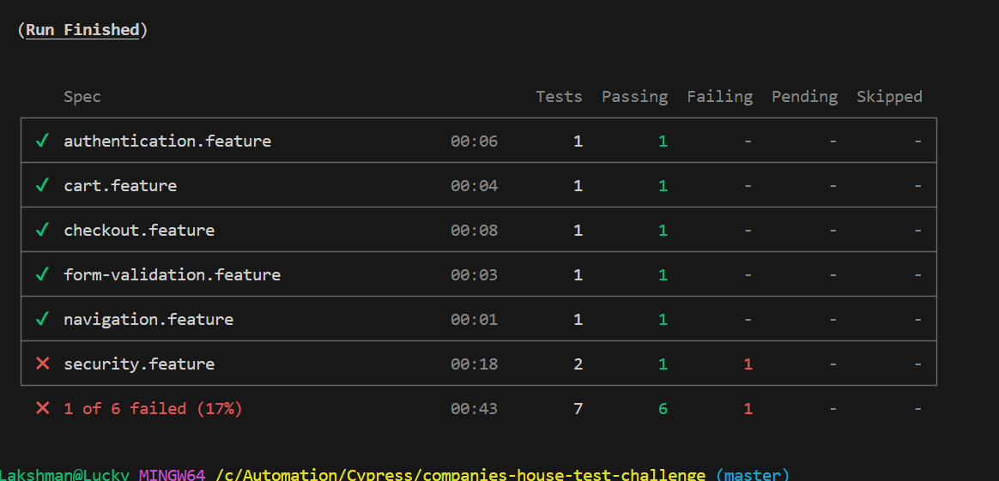

# DemoBlaze Cypress Test Framework
DemoBlaze
Overview
DemoBlaze (DemoBlaze) is the e-commrece test site.

User Management
 •	Creating users and offering access to the site.

E-commerce Core Functionality
•	Product filtering by categories
•	Add to shopping cart operations with quantity management
•	Shopping cart management (view, remove items)
•	Checkout process with payment validation
•	Session-specific cart data isolation

Order Processing
•	Order placement workflow
•	Order confirmation and tracking
•	User-specific order history

Refer https://www.demoblaze.com/ for further exploration.

## Installation Prerequisites
•	Node.js(v18 or v20 recommended)
•  npm (comes with Node.js)
•	Cypress - v14.5.2 - (v14+ recommended)
    npm install cypress@v14.5.2
•	IDE(ex:VSC)
•	Git Bash
•	Refer package.json

## Setup

1. **Clone the repository**
```sh
   git clone repo_link
```
2. **Navigate to the folder**

 ```sh
   cd DemoBlaze
   ```

3. **Install dependencies**
```sh
   npm install
   ```

4. **Install npx**
 ```sh
   npm i npx
   ```

## Project Structure
- `cypress/e2e/*` - Test specs and feature files (Gherkin)
- `cypress/e2e/**` - Cypress Test specs - Cucumber feature files
- `cypress/support/step_definitions` - step definitions
- `cypress/support/` - Custom commands(commands.js) and support files(e2e.js)
- `cypress.config.js` - Cypress configuration (plugins, environment variables, reporting)
- `cypress/fixtures/` - Test Data files such as JSON files, images and utilities
- `cypress/reports/` - Reports
- `cypress/screenshots/` - screenshots of the tests
- `cypress/videos/` - videos of the tests


## Running Tests
Refer custom scripts from package.json for easy reference.

### 1. Run All Tests (Headless)
```sh
npx cypress run
```

### 2. Run All Tests (Headed, Chrome)
```sh
npx cypress run --headed --browser chrome
```

### 3. Run Specific Test File
```sh
npx cypress run --spec cypress/e2e/search-filters.cy.js  --browser chrome
npx cypress run --spec cypress/e2e/features/agreements/search-agreements.feature

```
### 3. Run Specific Cypress Test File using only key word
first add 'only' keyword to 'it' block of the test you want to run and then use below command.
ex:
it.only('Mobile viewport - should display search and filters correctly on mobile', () => {

```sh
npx cypress run --spec cypress/e2e/search-filters.cy.js  --browser chrome

```

### 4. Run Tests by Tag
```sh
npx cypress run --env TAGS="@valid"
```
- You can combine with `--spec` to target a specific feature file.

### 5. Run Tests by custom scripts
```sh
npm run triggerCucmberTests-tags-multiple-or
```

### 6. Open Cypress Interactive Runner
```sh
npx cypress open
```

## Reports

- Test reports are generated in `cypress/reports/` using Mochawesome (HTML and JSON).
- Please note that the reports can only be generated when 'npx cypress run' used not 'npx cypress open'

## Environment Variables

- Default test data and selectors are set in `cypress.config.js` under the `env` key.
- To use tags or any environment variables, use the `--env` flag:
```sh
npx cypress run --spec cypress/e2e/features/agreements/search-agreements.feature --env TAGS=@valid --headed --browser chrome
  ```

## Troubleshooting

- If you see "Step implementation missing", ensure your step definitions use parameterized Cucumber expressions.
- If dependencies are missing, run `npm install` again.
- For issues with tags, use the `TAGS` environment variable as shown above.

## Further more on cypress tests:
 The suite does not includes a variety of test cases covering yet due to time constraint but cn be automated in the future.
•	Happy and unhappy search paths (valid, invalid, empty, special characters, random, short keywords, etc.)
•	Security (XSS), accessibility (keyboard navigation), and performance (UI responsiveness) checks
•	URL state persistence after reload
•	Pagination (placeholder for future logic)

cypress/support/commands.js : This file defines several custom Cypress commands that are used extensively in test suite. Here’s a summary of what each command does:

Test Execution:
